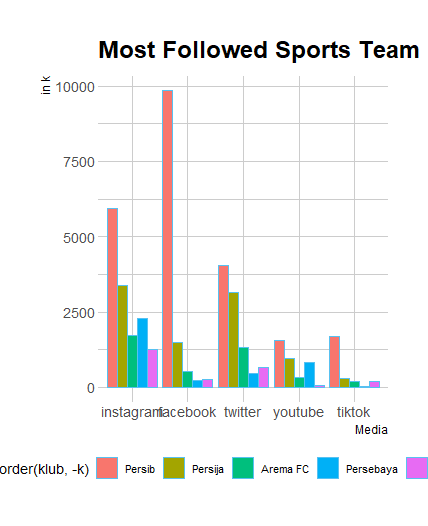

# Sport-Brands
.png)

# Code in R
`library(tidyverse) #read_csv` 

`#read file` 
`databola <- read_csv('databola.csv')` 

`#reshaped to longer` 
`databola_reshaped <- databola %>%` 
&emsp;&emsp;`pivot_longer(!klub, names_to = 'media', values_to = 'k')` 

`library(ggthemes) #themes` 
`install.packages("hrbrthemes")` 
`library(hrbrthemes)` 

`databola_reshaped %>%` 
&emsp;&emsp;`ggplot(aes(x=reorder(media,-k), y=k, fill=reorder(klub,-k))) +` 
&emsp;&emsp;`geom_bar(stat="identity", position="dodge") +` 
&emsp;&emsp;`xlab("Media") +` 
&emsp;&emsp;`ylab("in k") +` 
&emsp;&emsp;`ggtitle("Most Followed Sports Team in Indonesia") +` 
&emsp;&emsp;`theme_ipsum_pub() +` 
&emsp;&emsp;`theme(legend.position="bottom") #memindahkan legend ke bawah` 
	
#export file
`write.csv(databola_reshaped, "databola_reshaped.csv")` 
